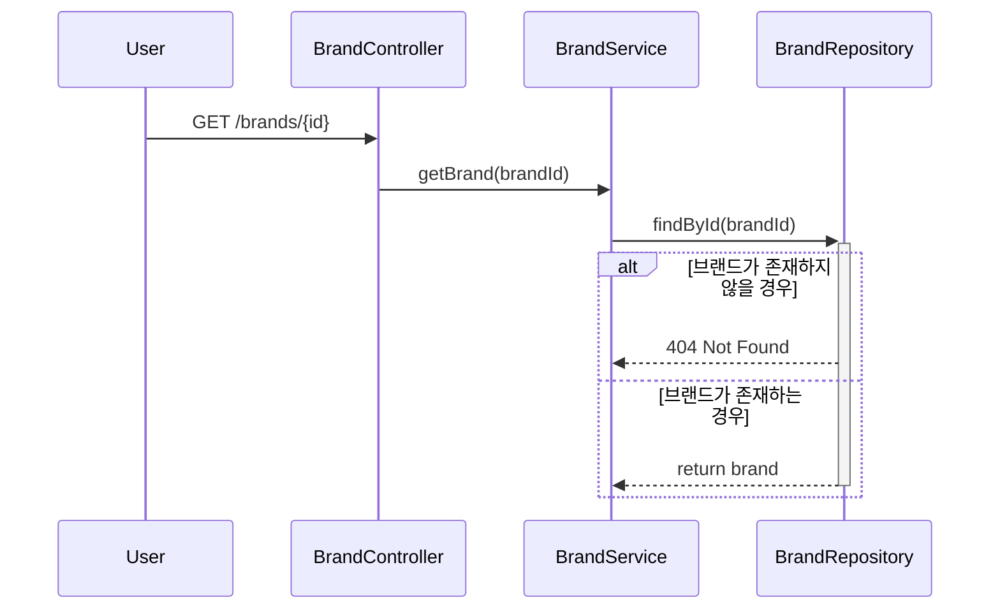
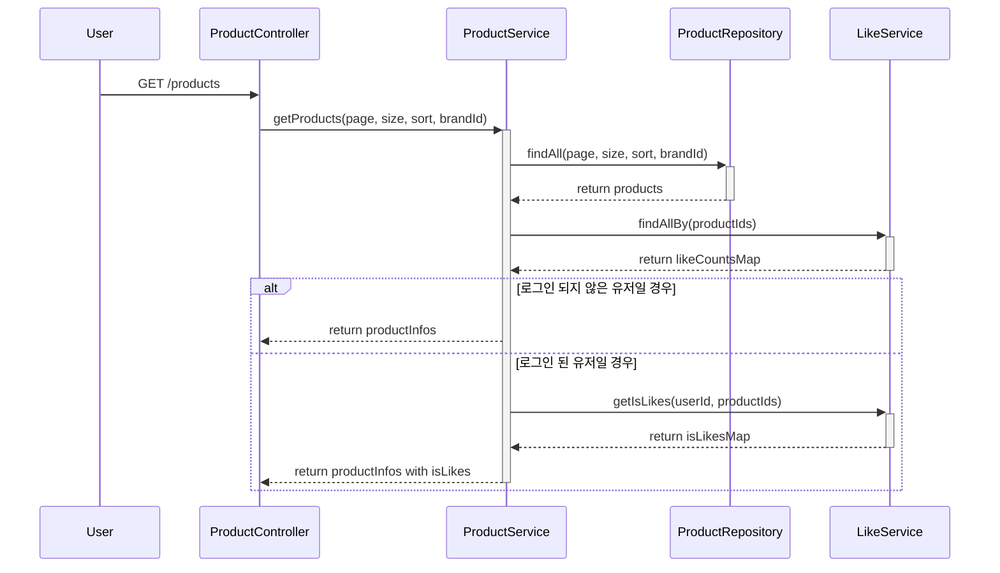
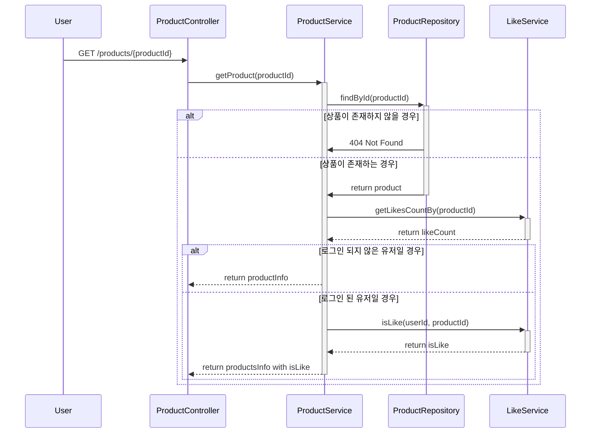
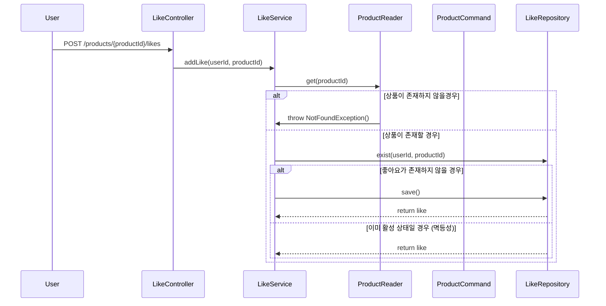
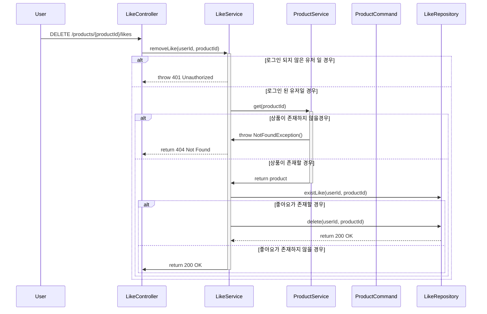
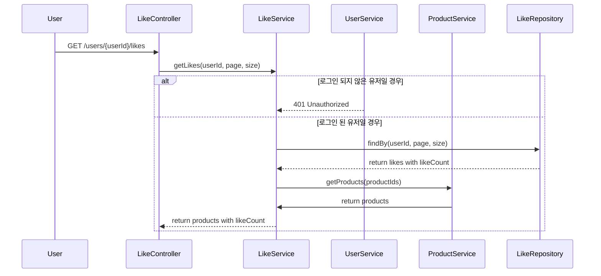
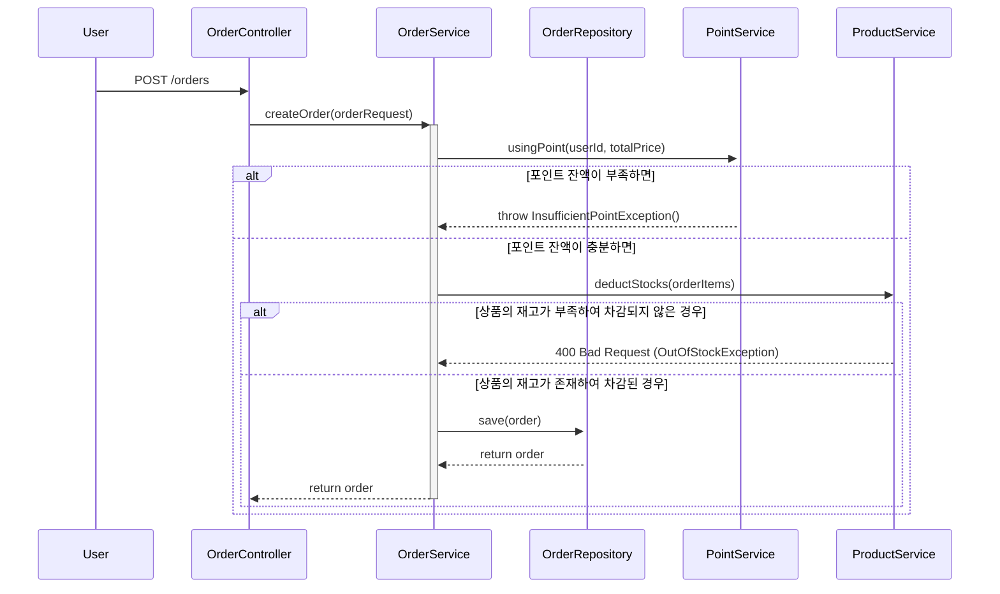
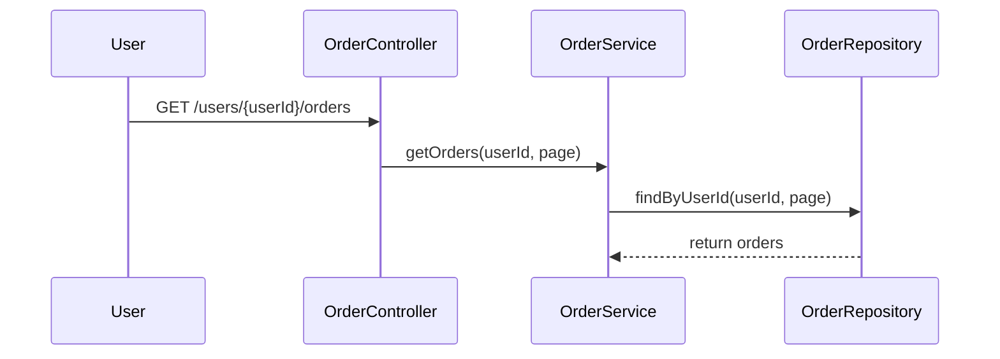
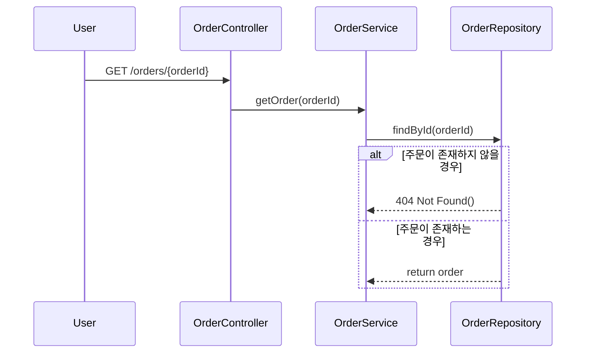

# 시퀀스 다이어그램

---
## 브랜드 & 상품
### 브랜드 조회 : GET /brands/{bandId}

### 상품 목록 조회 : GET /products

### 상품 정보 조회 : GET /products/{productId}

---
# 좋아요
### 상품 좋아요 등록 : POST /products/{productId}/likes

### 상품 좋아요 취소 : DELETE /products/{productId}/likes

### 좋아요 상품 목록 조회 : GET /users/{userId}/likes

---
# 주문
### 주문 생성 : POST /orders

### 주문 목록 조회 : GET /orders

### 주문 상세 조회 : GET /orders/{orderId}

