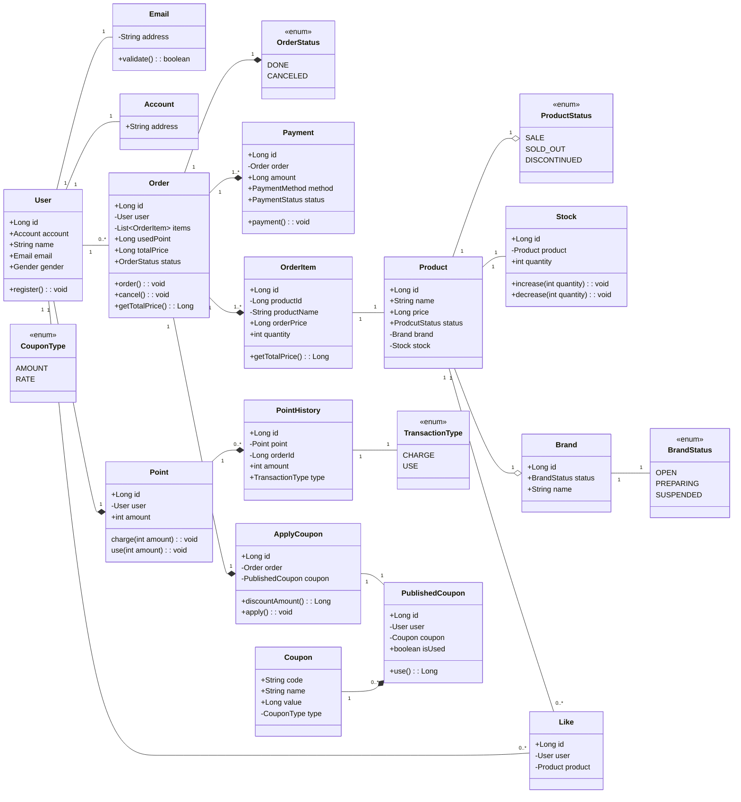

```mermaid
classDiagram
    direction LR

    class User {
        +Long id
        +Account account
        +String name
        +Email email
        +Gender gender
        +register(): void
    }
    class Email {
        -String address
        +validate(): boolean
    }
    class Account {
        +String address
    }
    class Product {
        +Long id
        +String name
        +Long price
        +ProdcutStatus status
        -Brand brand
        -Stock stock
    }
    class ProductStatus{
        <<enum>>
        SALE
        SOLD_OUT
        DISCONTINUED
    }
    
    class Stock {
        +Long id
        -Product product
        +int quantity
        +increase(int quantity): void
        +decrease(int quantity): void
    }

    class Brand {
        +Long id
        +BrandStatus status
        +String name
    }
    class BrandStatus {
        <<enum>>
        OPEN
        PREPARING
        SUSPENDED
    }

    class Like {
        +Long id
        -User user
        -Product product
    }

    class Order {
        +Long id
        -User user
        -List~OrderItem~ items
        +Long usedPoint
        +Long totalPrice
        +OrderStatus status
        +order(): void
        +cancel(): void
        +getTotalPrice(): Long
    }
    class OrderStatus {
        <<enum>>
        DONE
        CANCELED
    }
    
    class Payment {
        +Long id
        -Order order
        +Long amount
        +PaymentMethod method
        +PaymentStatus status
        +payment(): void
    }

    class OrderItem {
        +Long id
        -Long productId
        -String productName
        +Long orderPrice
        +int quantity
        +getTotalPrice(): Long
    }
    class ApplyCoupon {
        +Long id
        -Order order
        -PublishedCoupon coupon
        +discountAmount(): Long
        +apply(): void
    }
    
    class Point {
        +Long id
        -User user
        +int amount
        charge(int amount): void
        use(int amount): void
    }
    
    class PointHistory {
        +Long id
        -Point point
        -Long orderId
        +int amount
        +TransactionType type
    }
    class TransactionType {
        <<enum>>
        CHARGE
        USE
    }
    class Coupon {
        +String code
        +String name
        +Long value
        -CouponType type
    }
    class PublishedCoupon {
        +Long id
        -User user
        -Coupon coupon
        +boolean isUsed
        +use(): Long
    }
    class CouponType {
        <<enum>>
        AMOUNT
        RATE
    }
User "1" --* "1" Point
User "1" -- "0..*" Order
User "1" -- "0..*" Like
User "1" -- "1" Email
User "1" -- "1" Account

Product "1" -- "1" Stock
Product "1" -- "0..*" Like
Product "1" --o "1" Brand
Product "1" --o "1" ProductStatus

Brand "1" -- "1" BrandStatus

Point "1" --* "0..*" PointHistory
PointHistory "1" -- "1" TransactionType

Order "1" --* "1..*" OrderItem
Order "1" --* "1..*" Payment
Order "1" --* "1" OrderStatus
Order "1" --* "1" ApplyCoupon

OrderItem "1" -- "1" Product

Coupon "1" --* "0..*" PublishedCoupon
ApplyCoupon "1" -- "1" PublishedCoupon


```
