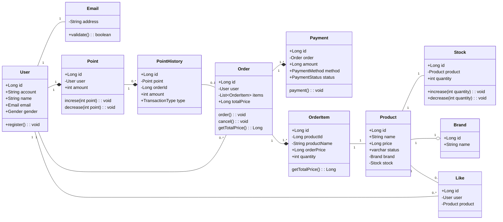

```mermaid
classDiagram
    direction LR

    class User {
        +Long id
        +String account
        +String name
        +Email email
        +Gender gender
        +register(): void
    }
    class Email {
        -String address
        +validate(): boolean
    }
    class Product {
        +Long id
        +String name
        +Long price
        +varchar status
        -Brand brand
        -Stock stock
    }
    
    class Stock {
        +Long id
        -Product product
        +int quantity
        +increase(int quantity): void
        +decrease(int quantity): void
    }

    class Brand {
        +Long id
        +String name
    }

    class Like {
        +Long id
        -User user
        -Product product
    }

    class Order {
        +Long id
        -User user
        -List~OrderItem~ items
        +Long totalPrice
        order(): void
        cancel(): void
        getTotalPrice(): Long
    }
    
    class Payment {
        +Long id
        -Order order
        +Long amount
        +PaymentMethod method
        +PaymentStatus status
        payment(): void
    }

    class OrderItem {
        +Long id
        -Long productId
        -String productName
        +Long orderPrice
        +int quantity
        getTotalPrice(): Long
    }
    
    class Point {
        +Long id
        -User user
        +int amount
        increse(int point): void
        decrease(int point): void
    }
    
    class PointHistory {
        +Long id
        -Point point
        -Long orderId
        +int amount
        +TransactionType type
    }
User "1" --* "1" Point
User "1" -- "0..*" Order
User "1" -- "0..*" Like
User "1" -- "1" Email

Product "1" -- "1" Stock
Product "1" -- "0..*" Like
Product "1" --o "1" Brand

Point "1" --* "0..*" PointHistory

Order "1" --* "1..*" OrderItem
Order "1" --* "1..*" Payment

OrderItem "1" -- "1" Product

PointHistory -- "0..1" Order
```
