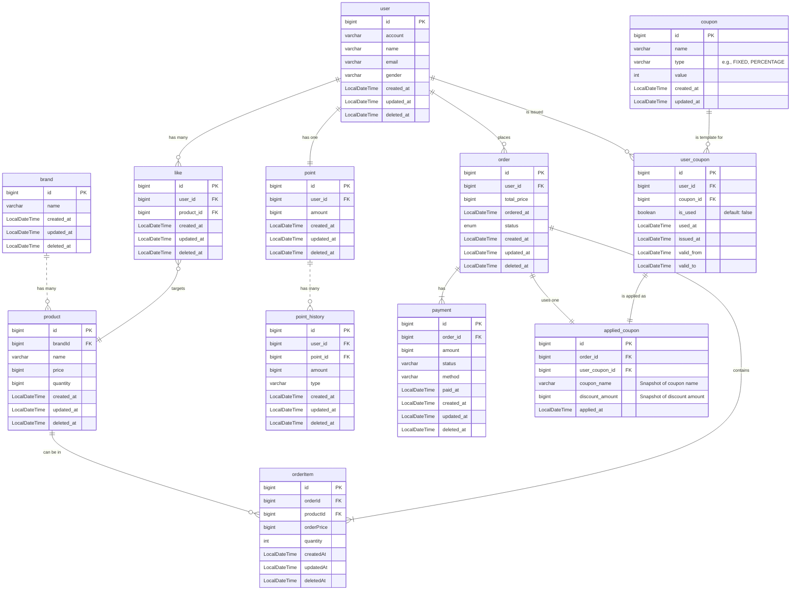

```mermaid
erDiagram
    product {
        bigint id PK
        bigint brandId FK
        varchar name
        bigint price
        bigint quantity
        LocalDateTime created_at
        LocalDateTime updated_at
        LocalDateTime deleted_at
    }
    user {
        bigint id PK
        varchar account
        varchar name
        varchar email
        varchar gender
        LocalDateTime created_at
        LocalDateTime updated_at
        LocalDateTime deleted_at
    }
    point {
        bigint id PK
        bigint user_id FK
        bigint amount
        LocalDateTime created_at
        LocalDateTime updated_at
        LocalDateTime deleted_at
    }
    point_history {
        bigint id PK
        bigint user_id FK
        bigint point_id FK
        bigint amount
        varchar type
        LocalDateTime created_at
        LocalDateTime updated_at
        LocalDateTime deleted_at
    }
    brand {
        bigint id PK
        varchar name
        LocalDateTime created_at
        LocalDateTime updated_at
        LocalDateTime deleted_at
    }
    like {
        bigint id PK
        bigint user_id FK
        bigint product_id FK
        LocalDateTime created_at
        LocalDateTime updated_at
        LocalDateTime deleted_at
    }
    order {
        bigint id PK
        bigint user_id FK
        bigint total_price
        LocalDateTime ordered_at
        enum status
        LocalDateTime created_at
        LocalDateTime updated_at
        LocalDateTime deleted_at
    }
    payment {
        bigint id PK
        bigint order_id FK
        bigint amount
        varchar status
        varchar method
        LocalDateTime paid_at
        LocalDateTime created_at
        LocalDateTime updated_at
        LocalDateTime deleted_at
    }
    orderItem {
        bigint id PK
        bigint orderId FK
        bigint productId FK
        bigint orderPrice
        int quantity
        LocalDateTime createdAt
        LocalDateTime updatedAt
        LocalDateTime deletedAt
    }
    coupon {
        bigint id PK
        varchar name
        varchar type "e.g., FIXED, PERCENTAGE"
        int value
        LocalDateTime created_at
        LocalDateTime updated_at
    }
    user_coupon {
        bigint id PK
        bigint user_id FK
        bigint coupon_id FK
        boolean is_used "default: false"
        LocalDateTime used_at
        LocalDateTime issued_at
        LocalDateTime valid_from
        LocalDateTime valid_to
    }
    applied_coupon {
        bigint id PK
        bigint order_id FK
        bigint user_coupon_id FK
        varchar coupon_name "Snapshot of coupon name"
        bigint discount_amount "Snapshot of discount amount"
        LocalDateTime applied_at
    }

    user ||--o{ like : "has many"
    user ||--o{ order : "places"
    user ||--o{ user_coupon : "is issued"
    user ||--|| point : "has one"
    point ||..o{ point_history : "has many"
    brand ||..o{ product : "has many"
    product ||--o{ orderItem : "can be in"
    like }o--|| product : "targets"
    order ||--|{ orderItem : "contains"
    order ||--|{ payment : "has"
    order ||--|| applied_coupon : "uses one"
    coupon ||--o{ user_coupon : "is template for"
    user_coupon ||--|| applied_coupon : "is applied as"
```
