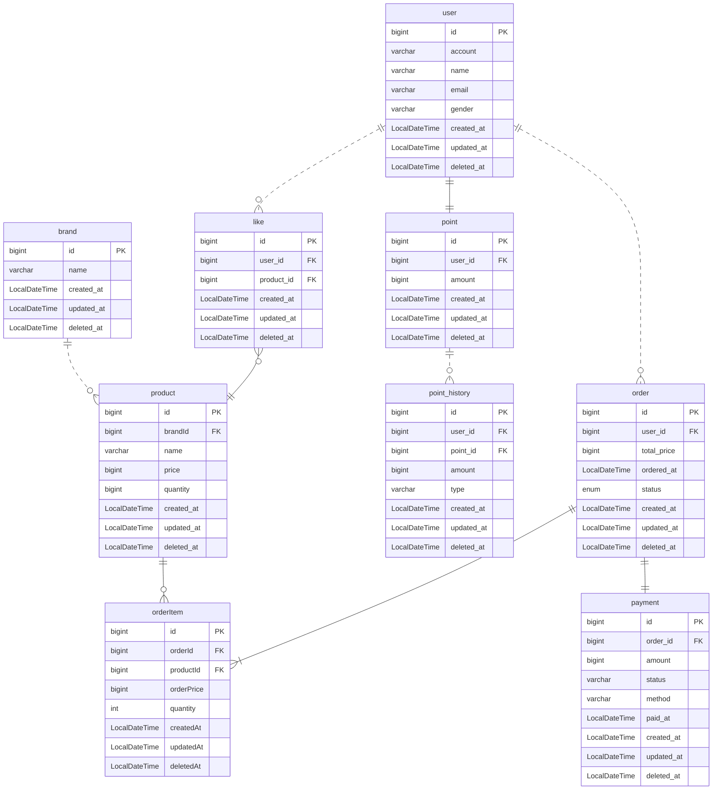

```mermaid
erDiagram
    product {
        bigint id PK
        bigint brandId FK
        varchar name
        bigint price
        bigint quantity
        LocalDateTime created_at
        LocalDateTime updated_at
        LocalDateTime deleted_at
    }
    user {
        bigint id PK
        varchar account
        varchar name
        varchar email
        varchar gender
        LocalDateTime created_at
        LocalDateTime updated_at
        LocalDateTime deleted_at
    }
    point {
        bigint id PK
        bigint user_id FK
        bigint amount
        LocalDateTime created_at
        LocalDateTime updated_at
        LocalDateTime deleted_at
    }
    point_history {
        bigint id PK
        bigint user_id FK
        bigint point_id FK
        bigint amount
        varchar type
        LocalDateTime created_at
        LocalDateTime updated_at
        LocalDateTime deleted_at
    }
    brand {
        bigint id PK
        varchar name
        LocalDateTime created_at
        LocalDateTime updated_at
        LocalDateTime deleted_at
    }
    like {
        bigint id PK
        bigint user_id FK
        bigint product_id FK
        LocalDateTime created_at
        LocalDateTime updated_at
        LocalDateTime deleted_at
    }
    order {
        bigint id PK
        bigint user_id FK
        bigint total_price
        LocalDateTime ordered_at
        enum status
        LocalDateTime created_at
        LocalDateTime updated_at
        LocalDateTime deleted_at
    }
    payment {
        bigint id PK
        bigint order_id FK
        bigint amount
        varchar status
        varchar method
        LocalDateTime paid_at
        LocalDateTime created_at
        LocalDateTime updated_at
        LocalDateTime deleted_at
    }
    orderItem {
        bigint id PK
        bigint orderId FK
        bigint productId FK
        bigint orderPrice
        int quantity
        LocalDateTime createdAt
        LocalDateTime updatedAt
        LocalDateTime deletedAt 
    }

    user ||..o{ like : ""
    user ||..o{ order : ""
    user ||--|| point : ""
    point ||..o{ point_history : ""
    brand ||..o{ product : ""
    product ||--o{ orderItem : ""
    like }o--|| product : ""
    order ||--|{ orderItem : ""
    order ||--|| payment : ""
    
```
