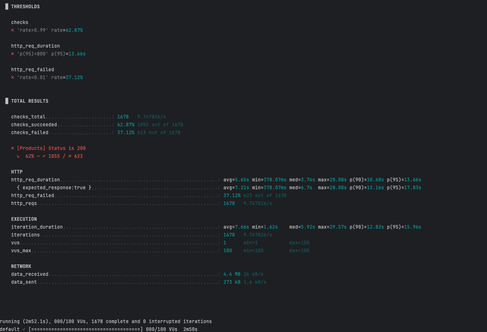
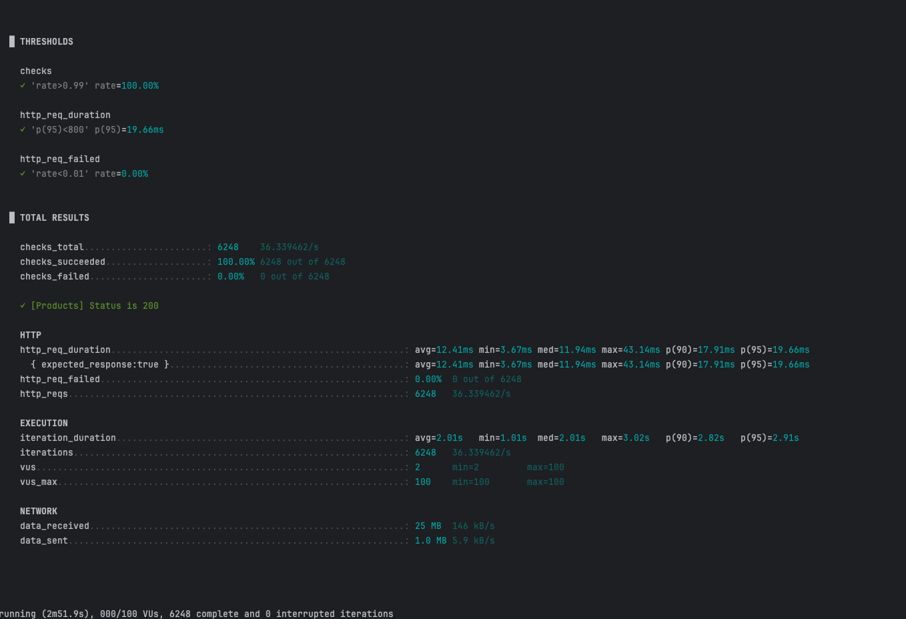
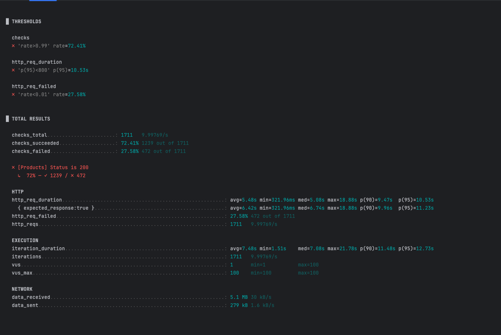
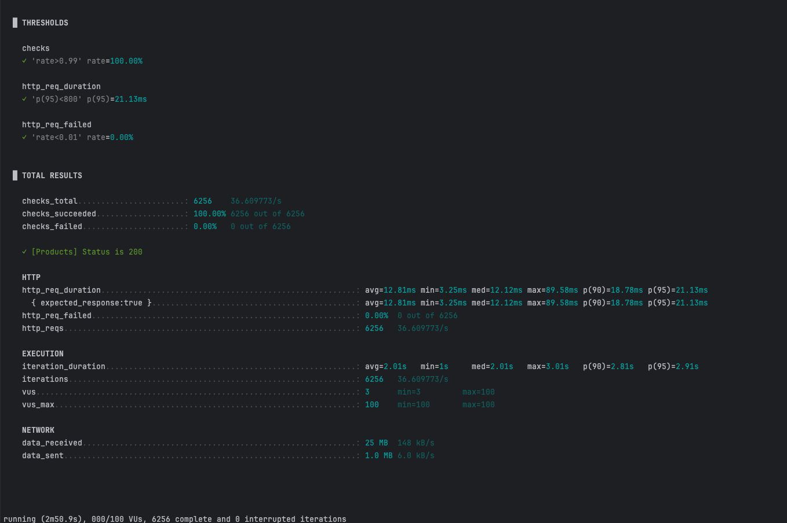
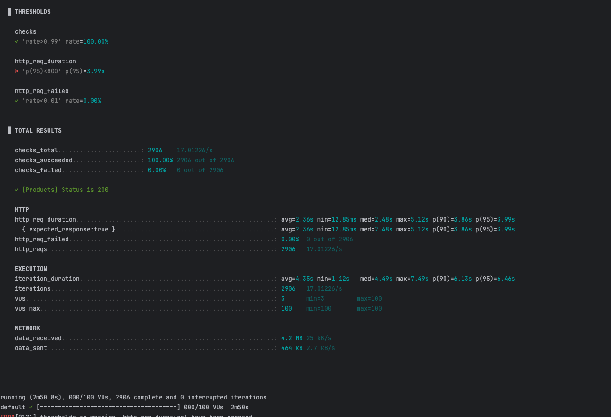
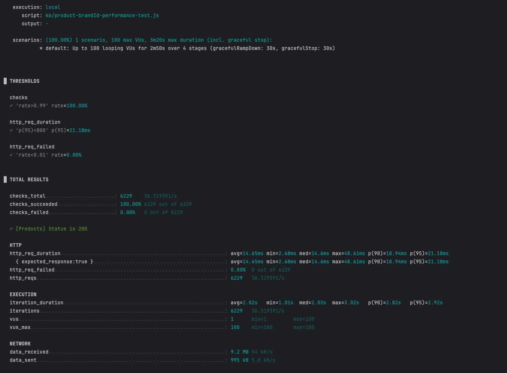

# 상품조회 인덱스 비교 문서
쿼리 실행 속도 개선을 위한 인덱스 추가를 검토하기 위해 상품 조회 쿼리의 실행 계획 및 K6 벤치마크 결과를 비교합니다.
- 조회 데이터 : 약 100만건
- 공통 조회 조건 : 판매 상태가 SALE인 상품
- 정렬 기준 : 가격순, 인기순, 브랜드별 인기순
- 조회 건수 : 30건
- k6 벤치마크 조건
  1. 테스트 시작 후 20초 동안 가상 사용자(Virtual Users, VUs)를 0명에서 50명까지 점진적으로 늘립니다.
  2. 1분(60초) 동안 가상 사용자를 50명에서 100명까지 추가로 늘립니다. 이 구간에서 시스템은 가장 높은 부하를 받게 됩니다.
  3. 60초 동안 가상 사용자를 100명에서 0명으로 점진적으로 줄입니다.
  4. 페이지는 랜던한 값으로 조회하며, 페이지당 30건의 데이터를 조회합니다.

### 케이스 1: 판매 상태 기준, 가격순 정렬 조회
GET /products?status=SALE&sort=price_asc
```SQL
    select * from product p1_0 where p1_0.status='SALE' order by p1_0.price desc limit 300,30;
```
1. as-is
- 쿼리 실행 계획
다음과 같이 쿼리가 동작하여 약 99만 건의 테이블 전체를 읽고 별도 정렬을 수행합니다.
```json
  {
    "type": "ALL",
    "rows": 989213,
    "filtered": 33.33,
    "Extra": "Using where; Using filesort"
  }
 ```
- k6 벤치마크 결과


| 지표 (Metric) | 결과 (Result) | 분석 및 의미 (Analysis & Meaning) |
| :--- | :--- | :--- |
| 평균 응답 시간 (avg) | 5.65 s | 모든 요청의 평균 완료 시간이 5초를 초과하여 매우 느림 |
| p(95) 응답 시간 | **13.66 s** | 대부분의 요청(95%)이 완료까지 13초 이상 걸려 사실상 타임아웃 |
| 요청 실패율 | **37.12%** | 3개 중 1개 이상의 요청이 실패하여 서비스 신뢰도 심각 |
평균 5초 이상의 응답 시간과 37%에 달하는 실패율은 일반 사용자가 서비스를 정상적으로 이용할 수 없는 **심각한 성능 저하 상태**임을 명확히 보여줍니다. 
### 2. to-be
- 인덱스 추가
- 판매상품에 price에 대하여 인덱스를 추가하여 쿼리 성능을 개선합니다.
```sql
create index idx_price on product (price);
```
- 쿼리 실행 계획
인덱스 추가후 idx_price 인덱스를 사용하여 offset 300에 대하여 rows가 989,213에서 330으로 줄어들었습니다.
```json
{
  "type": "range",
  "key": "idx_price",
  "rows": 330,
  "filtered": 33.33,
  "Extra": "Using index condition"
}
```
- k6 벤치마크 결과

 | 지표 (Metric) | 결과 (Result) | 분석 및 의미 (Analysis & Meaning) |
  | :--- | :--- | :--- |
  | 평균 응답 시간 (avg) | 12.41 ms | 모든 요청의 평균 완료 시간이 12ms로 유저가 체감하기 힘든 처리 속도임 |
  | p(95) 응답 시간 | **19.66 ms** | 대부분의 요청(95%)이 완료까지 13ms 이상 걸려 유저 동작에 문제 없음 |
  | 요청 실패율 | **0%** | 전체 요청 성공 |
응답 속도 개선: p(95) 응답 시간이 13.66초에서 19.66밀리초(ms)로 감소되었습니다.
서비스 안정성 확보: 실패율이 37.12%에서 0%로 감소하여 모든 요청을 안정적으로 처리하게 되었습니다.


### 케이스 2: 판매 상태 기준, 인기순 정렬 조회
```SQL
   select * from product p1_0 where p1_0.status='SALE' order by p1_0.like_count desc limit 300,30;
```
## 1. as-is
- 다음과 같이 쿼리가 동작하여 약 99만 건의 테이블 전체를 읽고 별도 정렬을 수행합니다.
```json
{
  "type": "ALL",
  "rows": 989213,
  "filtered": 33.33,
  "Extra": "Using where; Using filesort"
}
```
- k6 벤치마크 결과
  

| 지표 (Metric) | 결과 (Result) | 분석 및 의미 (Analysis & Meaning)          |
| :--- |:------------|:--------------------------------------|
| 평균 응답 시간 (avg) | 5.48 s      | 모든 요청의 평균 완료 시간이 5초를 초과하여 매우 느림       |
| p(95) 응답 시간 | **10.66 s** | 대부분의 요청(95%)이 완료까지 10초 이상 걸려 사실상 타임아웃 |
| 요청 실패율 | **27.58%**  | 3개 중 1개 이상의 요청이 실패하여 서비스 신뢰도 심각       |
평균 5초 이상의 응답 시간과 27%에 달하는 실패율은 일반 사용자가 서비스를 정상적으로 이용할 수 없는 **심각한 성능 저하 상태**임을 명확히 보여줍니다. 
## 2. to-be
- 인덱스 추가
- 판매상품에 like_count 컬럼에 대하여 인덱스를 추가하여 쿼리 성능을 개선합니다.
```sql
create index idx_like_count on product (like_count);
```
- 쿼리 실행 계획
  인덱스 추가후 idx_price 인덱스를 사용하여 offset 300에 대하여 rows가 989,213에서 330으로 줄어들었습니다.
```json

{
  "type": "index",
  "key": "idx_like_count",
  "rows": 330,
  "filtered": 33.33
}
```
- k6 벤치마크 결과
  
  | 지표 (Metric) | 결과 (Result) | 분석 및 의미 (Analysis & Meaning) |
  | :--- | :--- | :--- |
  | 평균 응답 시간 (avg) | 12.81 ms | 모든 요청의 평균 완료 시간이 12밀리초(ms)로 유저가 체감하기 힘든 처리 속도임 |
  | p(95) 응답 시간 | **21.13 ms** | 대부분의 요청(95%)이 완료까지 13밀리초(ms) 이상 걸려 유저 동작에 문제 없음 |
  | 요청 실패율 | **0%** | 전체 요청 성공 |
  응답 속도 개선: p(95) 응답 시간이 10.66초에서 21.13밀리초(ms)로 감소되었습니다.
  서비스 안정성 확보: 실패율이 37.12%에서 0%로 감소하여 모든 요청을 안정적으로 처리하게 되었습니다.

### 케이스 3: 특정 브랜드의 판매 상품, 최신순 정렬 조회
```SQL
   select * from product p1_0 where p1_0.status='SALE' and p1_0.brand_id=339 order by id desc limit 300,30;
```
- as-is
- 쿼리 실행 계획
    다음과 같이 쿼리가 동작하여 약 330 건의 테이블 전체를 읽고 특정 상품만 별도로 필터링을 수행합니다. filtered가 3.33%로 낮은 상태입니다. index는 primary key로 사용되고 있습니다.
```json
{
  "type": "index",
  "key": "PRIMARY",
  "rows": 330,
  "filtered": 3.33,
  "Extra": "Using where; Using filesort"
}
```
- k6 벤치마크 결과
  

| 지표 (Metric) | 결과 (Result) | 분석 및 의미 (Analysis & Meaning)         |
| :--- |:------------|:-------------------------------------|
| 평균 응답 시간 (avg) | 2.65 s      | 모든 요청의 평균 완료 시간이 2초를 초과하여 매우 느림      |
| p(95) 응답 시간 | **3.99 s**  | 대부분의 요청(95%)이 완료까지 3초 이상 걸려 사실상 타임아웃 |
| 요청 실패율 | **0%**      | 요청은 전부 성공함                           |
평균 2초 이상의 응답 시간으로, 필터링이 없는 케이스보다 성능을 빠르지만 2초면 사용자가 불편을 느끼기에 충분한 시간으로 문제가 있는 상태입니다.
- to-be
```sql
create index idx_brand_id on product (brand_id);
```
- 쿼리 실행 계획
  인덱스 추가후 idx_brand_id 인덱스를 사용하여 offset 300에 대하여 rows가 330에서 1045으로 증가했습니다. filtered가 3.33% -> 33.33%로 개선되었습니다.
```json

{
  "type": "ref",
  "key": "idx_brand_id",
  "rows": 1045,
  "filtered": 33.33
}
```
- k6 벤치마크 결과
  
  | 지표 (Metric) | 결과 (Result) | 분석 및 의미 (Analysis & Meaning) |
  | :--- | :--- | :--- |
  | 평균 응답 시간 (avg) | 14.65 ms | 모든 요청의 평균 완료 시간이 14밀리초(ms)로 유저가 체감하기 힘든 처리 속도임 |
  | p(95) 응답 시간 | **21.18 ms** | 대부분의 요청(95%)이 완료까지 21밀리초(ms) 이상 걸려 유저 동작에 문제 없음 |
  | 요청 실패율 | **0%** | 전체 요청 성공 |
  응답 속도 개선: p(95) 응답 시간이 3.99초에서 14.57밀리초(ms)로 감소되었습니다.
